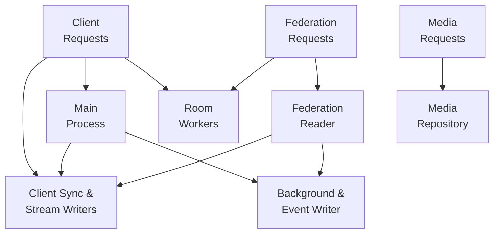

# Deploying a Synapse Homeserver with Docker

## Introduction

Welcome to my deployment guide for setting up a Matrix Synapse Homeserver using Docker. Our setup focuses on scalability and efficiency, using multiple "workers" to distribute workload and enhance performance.

Synapse, as the reference homeserver implementation for the Matrix network, offers flexible and decentralised communication capabilities, including messaging, voice calls, and custom integrations.

In a closed system, it performs exceptionally well on default settings, allowing many users to communicate in thousands of chats. However, when opening up to the internet to join public rooms, it can struggle to manage communicating with hundreds/thousands of other servers at the speed you'd expect from an instant communication platform.

There is a default model described in the [official documentation](https://matrix-org.github.io/synapse/latest/workers.html), but this design is optimised for a family or team of users to access federated rooms at high speed without using so much extra CPU and RAM.

## Model Explanation

In this deployment, we use a variety of Synapse workers, each with a specific role.

We want to give each worker plenty of work to do, so it's not just sitting around using memory for no reason, but also make sure we're not overwhelming individual workers in ways that impact the service.

Here's a diagram of how requests should flow once we're done:

- **Main Process**: Some requests can only go to the Synapse main process, but we also send client requests there when they don't include a room ID. This load is very light (typically signing keys and profile information) on a server with only a few active users, so they're safe to send here.

- **Client Sync & Stream Writers**: A user's main source of truth is from the sync feed, which we're dedicating to the Client Sync worker. By also having this worker responsible for most Stream Writing responsibilities, all other workers send it the typing/receipts/etc events they're aware of, to deliver them directly to users that need to know about them as quickly as possible.

- **Room Workers (4 Instances)**: When a user is trying to interact with a specific room, it makes sense to store the cache for a single room in a single worker to minimise the amount of caching each worker needs to do. Using load balancing that identifies requests with a room ID in them, we can send all requests for the same room to just one of the Room Workers, so as your server grows, you can simply add more Room Workers to spread the rooms across more workers.

- **Federation Reader**: When other servers are sending new data, these requests don't advertise the room ID in the URI, so we collect these on a single Federation Reader, which forwards the events to the Stream/Event Writers. All other requests from another homeserver that specify a room ID in them can go to the same Room Worker the clients use, which helps to make the most of its cache.

- **Media Repository**: For media requests, we send these to a dedicated media worker, which handles uploads of attachments/images, generates thumbnails, and provides downloads to both local clients and remote servers.

- **Background Tasks & Event Writing**: There are a number of background roles, including maintenance tasks, "pushing" notifications to users, and sending updates to any AppServices you have (like [bridges](https://matrix.org/ecosystem/bridges/)) that are generally quite low-stress for server with only a few active users, so we combine these with the Event Writer, which is typically only busy when joining a very large/complex room.

- **Federation Senders (4 Instances)**: These aren't displayed above, as they don't handle inbound requests, but we have several to balance the load so you can communicate with even the largest rooms.

## Getting Started

To get your Synapse Homeserver up and running, follow the configuration guides for each component. The end result should be a powerful, self-hosted communication platform. And as always, if questions pop up or you hit a snag, the [Synapse Admins](https://matrix.to/#/#synapse:matrix.org) room is there to lend a hand.
